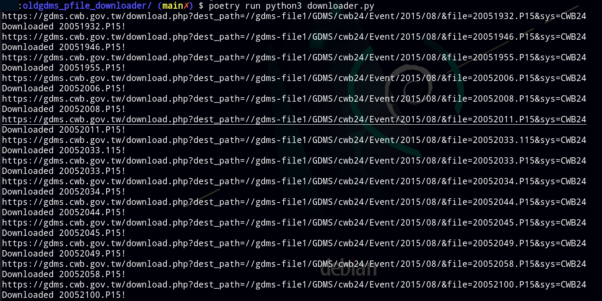

# GDM*Spy*: the Old-GDMS P-file Downloader

This program can help you login Old-GDMS system, and get Picking-file by filename in correct format you give.
If you have Earthquake Catalog from CWB Old-GDMS system, This program helps you a lot when you want to batch download multiple P-files.

* Note: If your research agency has archived several years of data, we encourage you to use that, preventing make too much load to that server.

## Download
- Windows: [Download page (v0.1.0)](https://github.com/sean0921/gdmspy/releases/tag/v0.1.0)

## Demo
- 
- 
- 
- 
- 
- 
- 

## Requirement
- Poetry (>=1.1.13)
- python3 (>=3.8)
- gtk3 (PyGObject >=3.38.0)
- zenipy (0.1.5)
- requests (>=2.25.1)
- urllib3 (>=1.26.5)

## Installation (Dependencies)
### System package first
```bash
sudo apt install python3-gi python3-requests python3-urllib3 libgtk-3-dev
pip install --user zenipy
```

### System pacakge and Poetry
```bash
sudo apt install libgtk-3-dev
cd $PROJECT_ROOT   ## enter your project top dir path
poetry install
```

## Usage
Installed by system pacakge fist:
```bash
python3 downloader.py
```

Installed by Poetry:
```bash
poetry run python3 downloader.py
```

## post processing
```bash
dos2unix *
sed -i 's/ \./0\./g' ????????.???  
sed -i 's/ -\./-0\./g' ????????.???                      
```

## Known Problems
Because GDMS website will still response HTTP 200 when Pfile search error occurs.  Please manually check your downloaded P-file format is correct by `file ????????.???` (in Unix-like system)
