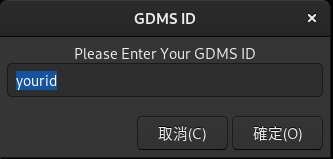
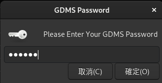
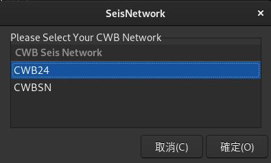
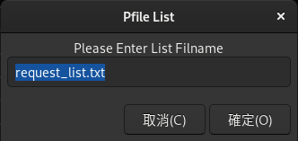
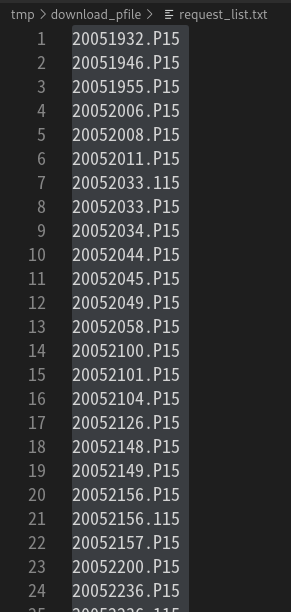
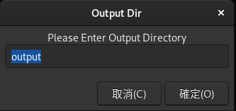

# oldgdms_pfile_downloader

## Requirement
- python3 (3.9)
- gtk3 (PyGObject 3.42.0)
- zenipy (0.1.5)
- requests (2.25.1)
- urllib3 (1.26.5)

## Usage
```bash
python3 downloader.py
```

## post processing
```bash
dos2unix *
sed -i 's/ \./0\./g' ????????.???  
sed -i 's/ -\./-0\./g' ????????.???                      
```

## Demo






